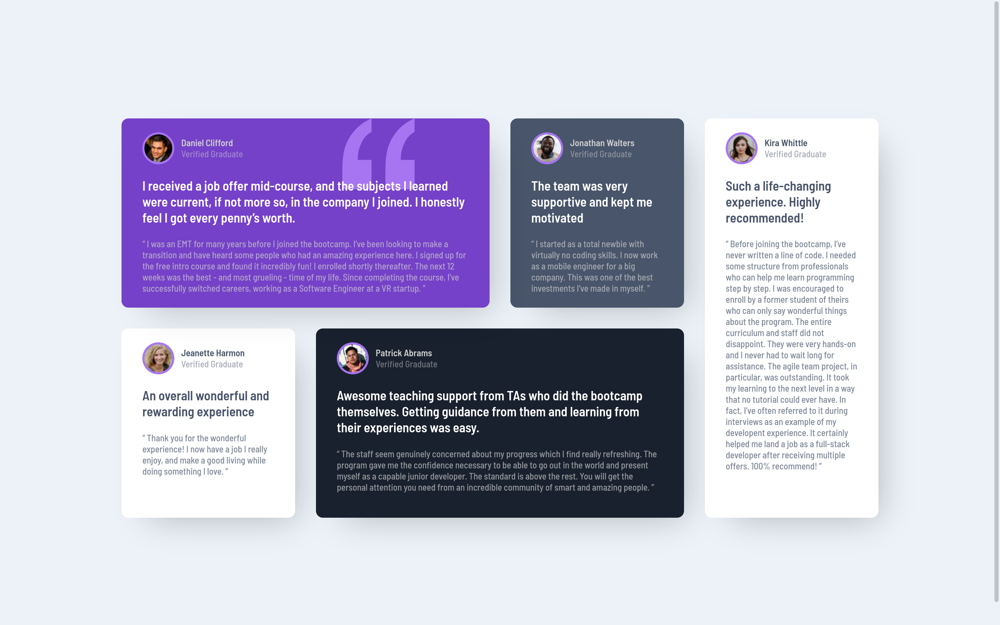

# Frontend Mentor - Testimonials grid section solution

This is a solution to the [Testimonials grid section challenge on Frontend Mentor](https://www.frontendmentor.io/challenges/testimonials-grid-section-Nnw6J7Un7). Frontend Mentor challenges help you improve your coding skills by building realistic projects. 

## Table of contents

- [Overview](#overview)
  - [The challenge](#the-challenge)
  - [Screenshot](#screenshot)
  - [Links](#links)
- [My process](#my-process)
  - [Built with](#built-with)
  - [What I learned](#what-i-learned)
  - [Continued development](#continued-development)
  - [Useful resources](#useful-resources)
- [Author](#author)
- [Acknowledgments](#acknowledgments)


## Overview

### The challenge

Users should be able to:

- View the optimal layout for the site depending on their device's screen size

### Screenshot




### Links

- Solution URL: [Code](https://github.com/NafisHandoko/testimonials-grid-section)
- Live Site URL: [Github Pages](https://nafishandoko.github.io/testimonials-grid-section/)


## My process

### Built with

- Semantic HTML5 markup
- CSS custom properties
- CSS Grid

### What I learned

I learned a lot about using grid especially grid-template as a grid shorthand properties

```css
.testimonials{
    display: grid;
    grid-template: 
        "daniel daniel jonathan kira" 1fr
        "jeanette patrick patrick kira" 1fr
        / 250px 250px 250px 250px;
    gap: 30px;
    margin: 40px 0 40px 0;
}
```

i also use media queries to make it responsive on mobile devices

```css
@media (max-width:580px){
    .testimonials{
        grid-template: 
            "daniel" auto
            "jonathan" auto
            "jeanette" auto
            "patrick" auto
            "kira" auto
            / 300px;
    }
}
```

### Continued development

I found some article about using repeat() and minmax() function to build responsive grid. I tried to use it on this challenge but then stucked so i ended up using media queries instead after looked for solutions corresponded to this challenge. After this, maybe i will learn it for future use.

### Useful resources

- [A Complete Guide to Grid | CSS-Tricks](https://css-tricks.com/snippets/css/complete-guide-grid/) - This article has a great explanation of using grid and all of its properties.
- [html - z-index not working with position absolute - Stack Overflow](https://stackoverflow.com/questions/14483589/z-index-not-working-with-position-absolute) - This one helped me to deal with z-index problem.
- [85 Beautiful CSS box-shadow examples - CSS Scan](https://getcssscan.com/css-box-shadow-examples) - This is an amazing resource to look for box-shadow inspirations and get better understanding of how box-shadow works.


## Author

- Website - [Nafis Handoko](https://nafishandoko.github.io)
- Frontend Mentor - [@nafishandoko](https://www.frontendmentor.io/profile/nafishandoko)
- Instagram - [@nafishandoko](https://www.instagram.com/nafishandoko)


## Acknowledgments

Big thanks to [Sayantani Patra](https://github.com/iamsayantanipatra) who helped me out of using responsive grid through her solution [here](https://www.frontendmentor.io/solutions/responsive-testimonials-grid-section-6flGR10TU).

